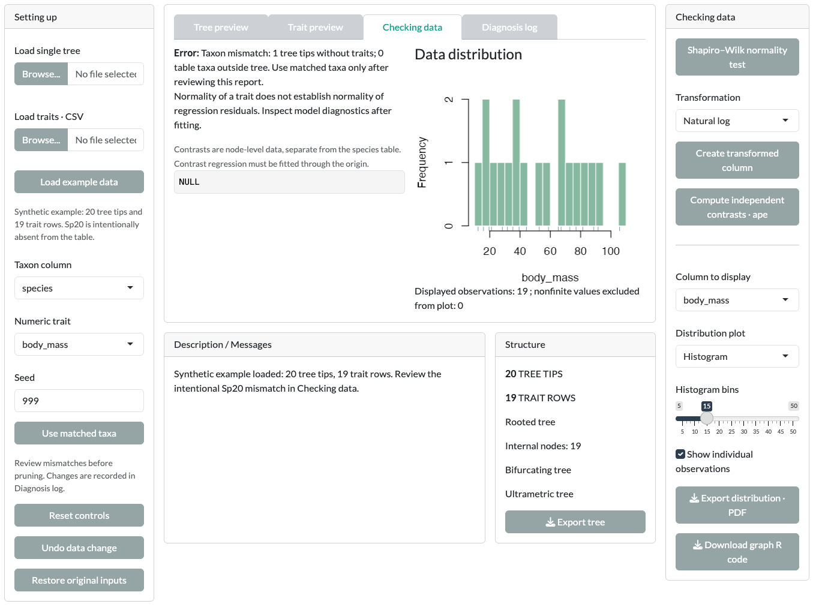
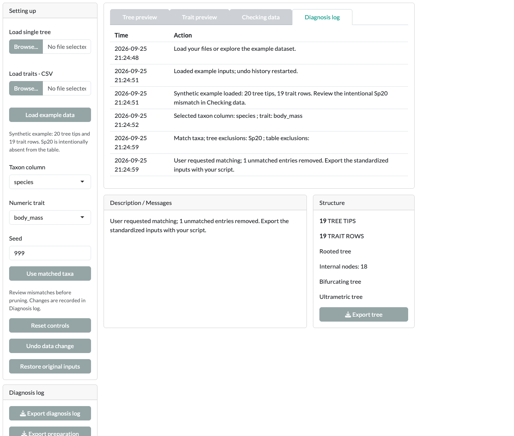
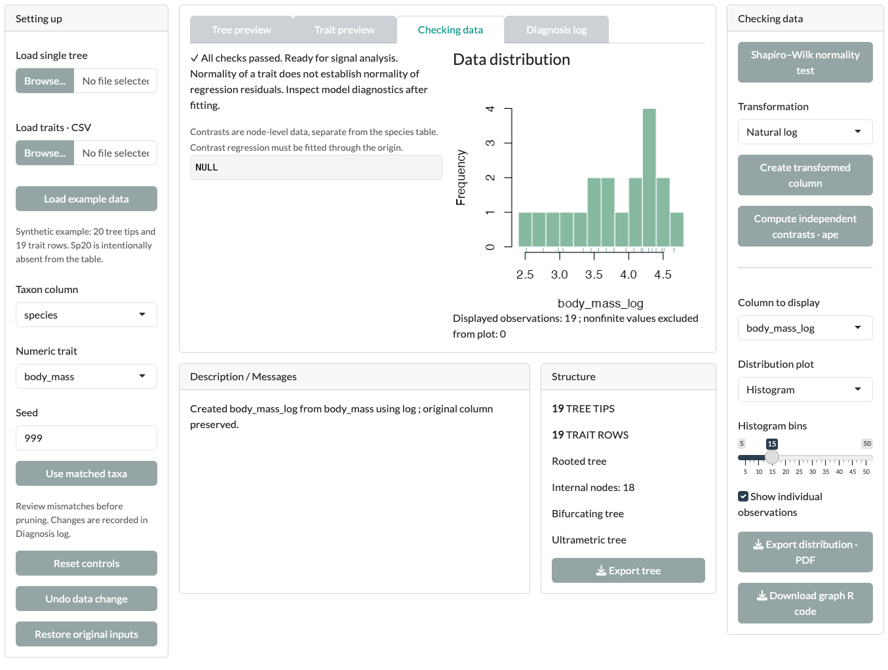

Every tutorial starts here. On this page you load the bundled example, find the deliberate mismatch between tree and table, and resolve it. You also create a transformed trait column.

::: {.guane-meta}
- **You'll learn** How to load data, match taxa explicitly, and create a transformed column.
- **Time** About 10 minutes
- **Prerequisites** [Guane installed and running](install.qmd)
:::

::: {.callout-warning title="Scientific caution"}
The bundled example is synthetic. Its values are invented, and its branch lengths are in arbitrary units, not ages. Results from it are a demonstration, not biological evidence.
:::

## The example files

Guane ships two files. [Load example data]{.ui} reads them; it does not generate new data each time.

- [`guane-example-tree.nwk`](../example/guane-example-tree.nwk): a rooted, bifurcating, ultrametric tree with **20 tips**, `Sp01` to `Sp20`. Its branch lengths are in arbitrary units (Grafen-scaled, total height 1), not ages.
- [`guane-example-traits.csv`](../example/guane-example-traits.csv): a trait table with **19 rows**, `Sp01` to `Sp19`.

`Sp20` has no row in the table on purpose. It lets you practise finding and resolving a mismatch.

## Column dictionary

::: {.guane-table-scroll role="region" tabindex="0" aria-label="Example trait columns"}
| Column | Type | Meaning or states | Example use |
|---|---|---|---|
| `species` | Identifier | Exact tree tip label | [Taxon column]{.ui} |
| `body_mass` | Continuous | Example mass in grams | Signal, PGLS, continuous reconstruction, QuaSSE |
| `body_length` | Continuous | Example length in centimetres | Signal, PGLS |
| `temperature` | Continuous | Example temperature in degrees Celsius | PGLS and PGLM predictor |
| `habitat_binary` | Discrete, 2 states | terrestrial, aquatic | Pagel's correlation, BiSSE, hidden-state models |
| `parental_care_binary` | Discrete, 2 states | absent, present | Pagel's correlation |
| `locomotion_3state` | Discrete, 3 states | walking, swimming, flying | Discrete reconstruction, MuSSE |
| `diet_5state` | Discrete, 5 states | herbivore, carnivore, omnivore, insectivore, frugivore | Discrete reconstruction, MuSSE |
| `resource_use_polymorphic` | Polymorphic | fruit, seed, insect, and combinations joined by `+` | Polymorphic reconstruction |
| `offspring_count` | Count | Invented nonnegative integer counts, including zeros | Count PGLM |
| `success_count` | Count | Invented number of successful trials | Grouped-binomial PGLM (successes) |
| `trial_count` | Count | Total attempts for that species | Grouped-binomial PGLM (trials) |
:::

A value such as `fruit+seed` means the species shows both states at once. It does not mean uncertainty or a missing value. Guane never turns a multistate trait into a binary one for you.

## Load and inspect

::: {.guane-steps}
1. Open a module, for example [Phylo traits]{.ui}, and open its [Data]{.ui} card.
2. Click [Load example data]{.ui}. [Description / Messages]{.ui} confirms 20 tree tips and 19 trait rows.
3. Open [Tree preview]{.ui} to see the tree. Use [Graphic controls]{.ui} to change its layout or labels.
4. Open [Trait preview]{.ui} to see the table. It shows 25 rows by default; change [Preview rows]{.ui} to see more. Analyses always use the whole table.
:::

## Resolve the mismatch {#match}

Analyses that combine a tree with traits reject mismatched data. You resolve it explicitly; Guane never prunes silently.

::: {.guane-steps}
1. Open [Checking data]{.ui}. The report says there is a taxon mismatch: one tree tip without traits and no table taxa outside the tree. [Description / Messages]{.ui} names `Sp20` as the intentional mismatch. The report begins with "Error:". This is expected; it blocks analyses until you match taxa.
2. Click [Use matched taxa]{.ui} in the [Setting up]{.ui} panel. Guane removes `Sp20` from the working tree.
3. Open [Diagnosis log]{.ui}. It records that `Sp20` was excluded. [Structure]{.ui} now shows 19 tree tips.
:::

{.guane-shot loading="lazy" fig-alt="Checking data tab reporting a taxon mismatch: one tree tip has no trait row, before Use matched taxa"}

{.guane-shot loading="lazy" fig-alt="Diagnosis log recording that Sp20 was excluded from the tree after Use matched taxa"}

The original 20-tip tree is kept. [Undo data change]{.ui} reverses the last preparation step. [Restore original inputs]{.ui} returns to the files as loaded.

::: {.callout-note title="Do this in each module"}
Each module has its own Data card. Load and match the example in every module where you use it. Tree-only cards, such as [Lineage through time]{.ui} in [Diversification]{.ui}, do not need matching.
:::

## Check and transform a trait

[Checking data]{.ui} also helps you look at a trait before you model it.

::: {.guane-steps}
1. With [Checking data]{.ui} open, make sure [Numeric trait]{.ui} in the [Setting up]{.ui} panel (left) is `body_mass`.
2. Click [Shapiro–Wilk normality test]{.ui} to test the selected column.
3. Set [Transformation]{.ui} to [Natural log]{.ui} and click [Create transformed column]{.ui}. Guane adds a new column, `body_mass_log`. The original `body_mass` stays unchanged.
4. Set [Column to display]{.ui} to `body_mass_log`. Choose a [Distribution plot]{.ui}: histogram, density or normal Q–Q.
5. Optionally, click [Compute independent contrasts · ape]{.ui}. Contrasts are node-level values, shown separately. They are not added to the species table.
:::

{.guane-shot loading="lazy" fig-alt="Histogram of the new body_mass_log column created by the Natural log transformation"}

Other transformations are exponential, quadratic and reciprocal. Each one creates a new column.

::: {.callout-note}
A normal trait distribution does not mean a fitted model has normal residuals. Check each model's [Diagnostics]{.ui} tab after you fit it.
:::

## Save the preparation record

With [Diagnosis log]{.ui} open, the left column offers [Export diagnosis log]{.ui} and [Export preparation script]{.ui}. With [Trait preview]{.ui} open, [Export traits]{.ui} saves the prepared table. See [Exports and reproducibility](../reference/exports.qmd).

## Using your own data

In the Data card, upload one tree with [Load single tree]{.ui} and one CSV with [Load traits · CSV]{.ui}.

- The tree must be Newick (`.nwk`, `.tre`) or Nexus (`.nex`, `.nexus`), with unique tip labels.
- The CSV needs one header row and a unique taxon column. Taxon names must match tip labels exactly.
- Guane does not prune, impute, root, resolve polytomies or recalibrate a tree for you. Each method may add stricter requirements.
- Tree-only diversification cards do not need a CSV.

For exact formats, see [Custom input formats](../reference/input-formats.qmd).

## Next step

Pick a tutorial: [Phylo traits](../tutorials/phylo-traits.qmd), [Ancestral state reconstruction](../tutorials/asr.qmd), [Diversification](../tutorials/diversification.qmd) or [SSE models](../tutorials/sse.qmd).
