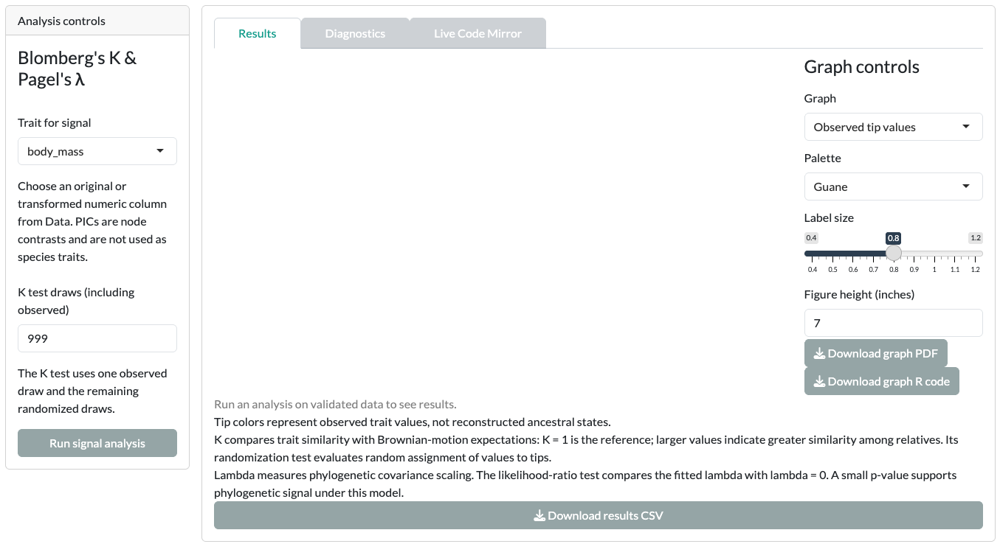

This page shows how Guane is organized. After it, you can find any card, run it and read its output. The tutorials assume you know this layout.

## Module pills

The top bar holds the language menu. Below it, four pills select a module:

- [Phylo traits]{.ui}: phylogenetic signal, PGLS, Pagel's correlation and PGLM.
- [Ancestral state reconstruction]{.ui}: continuous, discrete and polymorphic traits.
- [Diversification]{.ui}: lineages through time and rate models.
- [SSE models]{.ui}: BiSSE, MuSSE, QuaSSE and hidden-state models.

Inside a module, a second row of pills lists its cards. The first card is always [Data]{.ui}.

{.guane-shot loading="lazy" fig-alt="Guane window with the four module pills and the Phylo traits Data card showing the 20-tip example tree"}

## Each module has its own Data card

Every module keeps its own tree and trait table. Data you load in one module is not shared with the other three. When you switch module, load your data again in that module's [Data]{.ui} card.

The Data card has three columns:

- **Left:** the [Setting up]{.ui} panel. Load a tree and a CSV, choose the [Taxon column]{.ui} and [Numeric trait]{.ui}, set the [Seed]{.ui}, and use [Use matched taxa]{.ui}, [Undo data change]{.ui} or [Restore original inputs]{.ui}. [Reset controls]{.ui} clears the Data workspace.
- **Centre:** four tabs, [Tree preview]{.ui}, [Trait preview]{.ui}, [Checking data]{.ui} and [Diagnosis log]{.ui}. Below them, [Description / Messages]{.ui} and [Structure]{.ui} summarize the loaded data.
- **Right:** controls for the open tab. With [Tree preview]{.ui} open, this is the [Graphic controls]{.ui} panel. With [Checking data]{.ui} open, it holds the transformation and distribution tools.

The Data card's [Seed]{.ui} makes the randomization test in the [Phylogenetic signal]{.ui} card repeatable. Cards with other random steps have their own seed control, such as [MCMC seed]{.ui} or [Simulation seed]{.ui}.

[Example data and the Data card](example-data.qmd) walks you through each tab.

## Anatomy of an analysis card

Every analysis card has the same layout.

{.guane-shot loading="lazy" fig-alt="Analysis card with controls on the left and Results, Diagnostics and Live Code Mirror tabs, before a run"}

- **[Analysis controls]{.ui}** (left): choose the trait or model settings, then click the card's run button, for example [Run signal analysis]{.ui}. Some cards group less common settings under [Advanced fitting controls]{.ui} or [Advanced analysis controls]{.ui}.
- **[Results]{.ui}** tab: the graph, estimates and downloads. Before a run, it says "Run an analysis on validated data to see results." The [Graph controls]{.ui} column inside this tab changes which graph you see and how it looks. The ancestral state cards also have a [Reset graph controls]{.ui} button.
- **[Diagnostics]{.ui}** tab: warnings, optimizer checks and method-specific checks. Read it before you interpret [Results]{.ui}.
- **[Live Code Mirror]{.ui}** tab: the R code for the current analysis or its prepared settings. See [Exports and reproducibility](../reference/exports.qmd).

::: {.callout-note}
The Data card's panel is called [Graphic controls]{.ui}. Analysis cards call the same idea [Graph controls]{.ui}. Both change appearance only.
:::

## What keeps or clears a result

Guane fits a model only when you click a run button. Cosmetic changes never refit.

| You change | What happens |
|---|---|
| Language | Data, selections and fitted results stay. |
| Palette, labels, figure size or other graph appearance | The fitted result stays; the graph redraws. |
| Data, trait selection or model settings | The affected result may be cleared. Click the run button again. |

## Next step

Load the bundled example in [Example data and the Data card](example-data.qmd).
