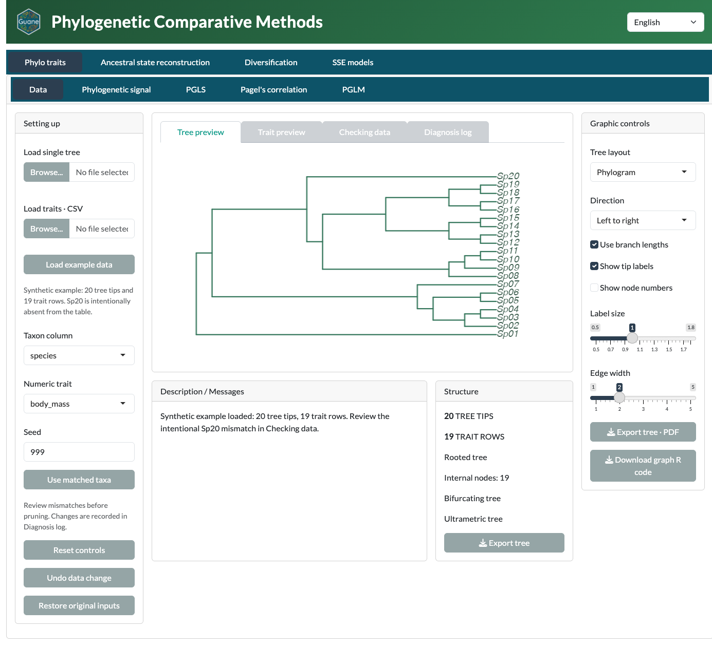

::: {.guane-hero}

::: {.guane-hero-text}

Guane is a  R/Shiny platform for phylogenetic comparative analyses through a user-friendly  and multilingual graphical interface

:::
{.guane-hero-logo .nolightbox fig-alt=""}
:::

## What Guane does

It joins a phylogenetic tree to species-level traits, makes data preparation visible, fits selected models through R scientific packages, and presents figures, numerical results, diagnostics, and editable R code, through established R packages. The interface is available in English, Spanish and Portuguese. 

{.guane-shot loading="lazy" fig-alt="Guane window with the four module pills and the Phylo traits Data card showing the 20-tip example tree"}

## Four modules

Each module has its own Data card and its own analysis cards.

::: {.guane-module-grid}
::: {.guane-module-card}
### [Phylo traits](tutorials/phylo-traits.qmd)

Phylogenetic signal, PGLS, Pagel's correlation and PGLM.
:::

::: {.guane-module-card}
### [Ancestral state reconstruction](tutorials/asr.qmd)

Continuous, discrete (Mk) and polymorphic traits.
:::

::: {.guane-module-card}
### [Diversification](tutorials/diversification.qmd)

Lineage through time, constant-rate, time-varying, clade and diversity-dependent models.
:::

::: {.guane-module-card}
### [SSE models](tutorials/sse.qmd)

BiSSE, MuSSE, QuaSSE and hidden-state models.
:::
:::

Each module also has an advanced tutorial: [Advanced phylo traits](tutorials/advanced/phylo-traits.qmd), [Advanced ancestral states](tutorials/advanced/asr.qmd), [Advanced diversification](tutorials/advanced/diversification.qmd) and [Advanced SSE models](tutorials/advanced/sse.qmd).

## Start here

- **You study evolution and want to run an analysis.** [Install and launch Guane](get-started/install.qmd), then take the [interface tour](get-started/tour.qmd).
- **You teach a comparative methods course.** Start with the [example data and the Data card](get-started/example-data.qmd). Each tutorial then uses the same bundled example.
- **You want reproducible R scripts.** Read [exports and reproducibility](reference/exports.qmd).
- **You already run your own data.** Use the [advanced tutorials](tutorials/advanced/index.qmd) to change controls beyond the defaults and judge the diagnostics.

## Honest science

::: {.callout-warning title="Scientific caution"}
The bundled example is synthetic. It teaches the interface; its results are not biological evidence. Before you report any result, read the [scientific limitations](reference/limitations.qmd) for the method you used.
:::
