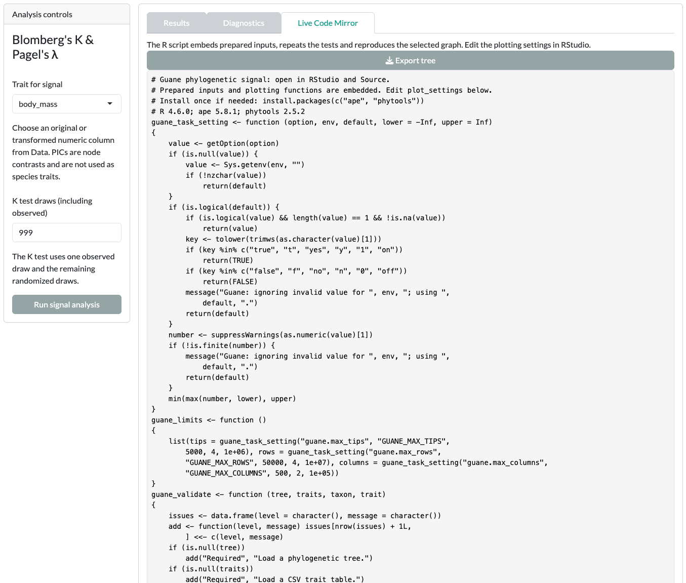

A figure alone is not a full record of an analysis. This page lists what Guane exports and what to keep together when you report a result.

## What each card exports

After a run, each analysis card offers downloads in its [Results]{.ui} tab. Graph downloads sit under [Graph controls]{.ui}; table downloads usually sit below the results table. The exact set depends on the card.

::: {.guane-table-scroll role="region" tabindex="0" aria-label="Export types"}
| Export | Typical label | What you get |
|---|---|---|
| Standalone R script | [Download graph R code]{.ui} | A standalone R script. It embeds the prepared data, reruns the analysis where the card supports it, and redraws the selected graph. Open it in RStudio and click Source. Check the card's [Live Code Mirror]{.ui} text to see whether that card refits or only redraws. |
| Graph image | [Download graph PDF]{.ui}, [Download graph PNG]{.ui} | The current graph as a file. |
| Tables | [Download results CSV]{.ui} and card-specific CSV downloads | Estimates, comparisons or diagnostics as CSV. |
| Saved result | [Download graph settings and result RDS]{.ui} | The saved result and settings as an R object, where the card supports it. |
:::

Some scripts need the scientific R packages that the card uses. Read the script header, and run it in an R session where those packages are installed.

## Live Code Mirror

The [Live Code Mirror]{.ui} tab shows R code for the current analysis. Before a run, it shows the prepared settings; after a run, it shows the code for the saved result.

The script starts with Guane's helper functions; the analysis calls follow them. The tab has no download button. To save the script, use [Download graph R code]{.ui} in [Results]{.ui}.

{.guane-shot loading="lazy" fig-alt="Live Code Mirror showing the start of the R script that reproduces the signal analysis"}

## Data preparation record

The Data card keeps an audit trail of what you did to your inputs.

- With [Diagnosis log]{.ui} open: [Export diagnosis log]{.ui} saves the log as CSV, and [Export preparation script]{.ui} saves an R script that replays the preparation steps.
- With [Trait preview]{.ui} open: [Export traits]{.ui} saves the prepared trait table.
- With [Tree preview]{.ui} open: [Export tree · PDF]{.ui} saves the tree drawing, and [Download graph R code]{.ui} saves its plotting code.

## What to keep when reporting

Keep these together so another analyst can reproduce the saved graph and, where supported, rerun the fit:

- The tree and trait table you analysed, after preparation.
- The diagnosis log and preparation script.
- The card's settings: method, engine, model, conditioning, starts, bounds, priors and seeds.
- Every diagnostic message and warning, including failed candidates and unresolved limits.
- The exported R script and the versions of Guane and the R packages it used.
- The interval type, its reference level, and what was held fixed.

The [minimum information to report](limitations.qmd#minimum-reporting) lists the full checklist.
