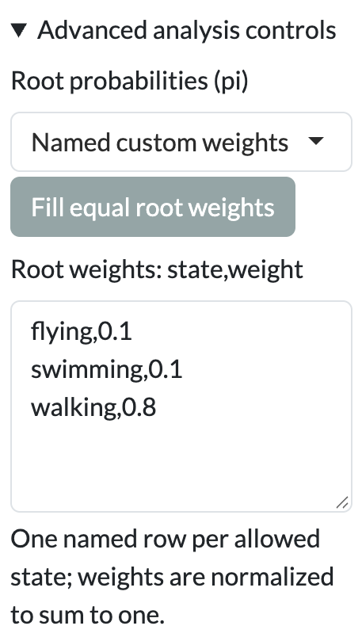
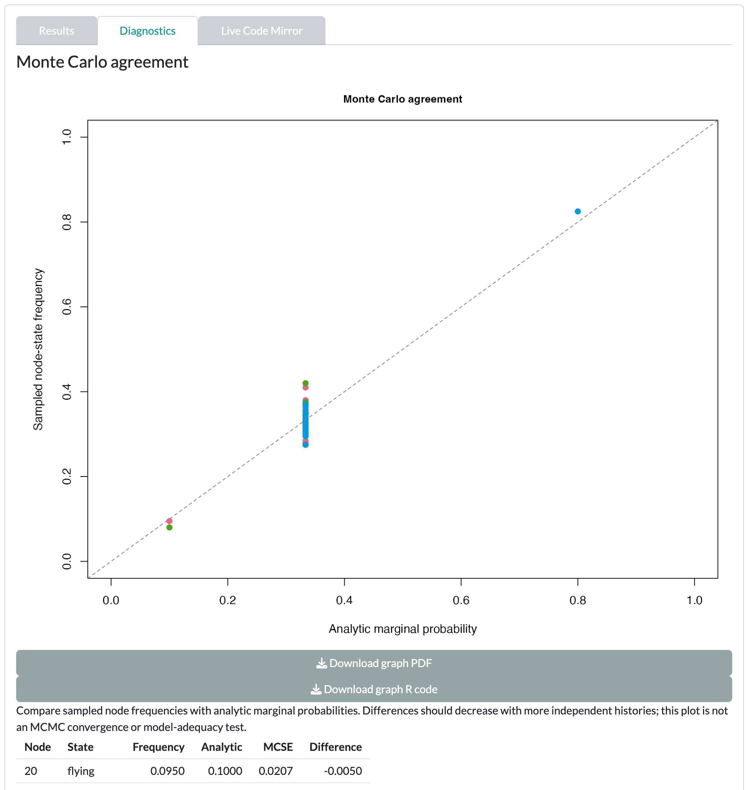

The worked example shows what a root prior does when the data carry no information.

::: {.guane-meta}
- **You'll learn** What the root prior, fixed Q, optimizer bounds and sampling controls change, and how to spot a reconstruction that only echoes its inputs.
- **Time** About 35 minutes
- **Prerequisites** [Ancestral state reconstruction tutorial](../asr.qmd); example loaded and matched in the Ancestral state reconstruction Data card
:::

::: {.callout-warning title="Scientific caution"}
The bundled example is synthetic. Its values are invented and its branch lengths are arbitrary. Results are a demonstration, not biological evidence.
:::

## Before you start

Load the example in the [Ancestral state reconstruction]{.ui} [Data]{.ui} card and click [Use matched taxa]{.ui}. [Resolve the mismatch](../../get-started/example-data.qmd#match) shows each step. The [Discrete traits]{.ui} and [Polymorphic traits]{.ui} cards share one collapsed section, [Advanced analysis controls]{.ui}. It is shown unless [Framework]{.ui} is [Bayesian Mk (sample rates)]{.ui}.

## Root and rate matrix

::: {.guane-control}
### Root probabilities (pi)

Sets the prior probability of each state at the root.

Where
: [[Discrete traits]{.ui} [Advanced analysis controls]{.ui} [Root probabilities (pi)]{.ui}]{.guane-path}

Default
: [Equal weights]{.ui}

Change it when
: You have independent evidence about the root state, for example from fossils or an outgroup. Choose [Named custom weights]{.ui}, click [Fill equal root weights]{.ui}, then edit the [Root weights: state,weight]{.ui} box. See the [root weights format](../../reference/input-formats.qmd#root-weights).

Check after
: The [Effective settings preview]{.ui} is the exact R call Guane will run. Your weights are in its `pi` entry, written in R's exact hexadecimal notation: `0x1.999999999999ap-4` is 0.1, and `0x1.999999999999ap-1` is 0.8. The plain check comes after the run: the root node's row in the node probabilities table. If the root probabilities match your weights exactly, the data added nothing at the root.
:::

::: {.guane-control}
### Transition rates

Chooses whether Guane estimates the rate matrix or uses one you supply.

Where
: [[Discrete traits]{.ui} [Advanced analysis controls]{.ui} [Transition rates]{.ui}]{.guane-path}

Default
: [Estimate rates]{.ui}

Change it when
: You want to reconstruct under rates taken from another study or another fit. Choose [Supply fixed Q]{.ui}, click [Fill Q template from constraints]{.ui}, and edit the [Fixed Q: named CSV matrix]{.ui} box. Untick [Compare with ER, SYM and ARD]{.ui}: a fixed Q is not fitted, so there is nothing to compare. See the [fixed Q format](../../reference/input-formats.qmd#fixed-q).

Check after
: "Fixed Q must preserve the selected model rate-sharing constraints." A fixed Q has no convergence to check; its rates are your assumption.
:::

::: {.guane-control}
### Optimization settings

Chooses the optimizer starts and exposes the rate bounds.

Where
: [[Discrete traits]{.ui} [Advanced analysis controls]{.ui} [Optimization settings]{.ui}]{.guane-path}

Default
: [Guane: three deterministic starts]{.ui}, with [Lower rate bound (min.q)]{.ui} 1e-10 and [Upper rate bound]{.ui} 100

Change it when
: Starts disagree, or a rate sits at a bound and you want to test whether the bound matters. [Custom starting rates]{.ui} opens [Starting rates (q.init)]{.ui}; see the [starting rates format](../../reference/input-formats.qmd#starting-rates).

Check after
: The [Optimizer starts]{.ui} graph in [Results]{.ui}, and in [Diagnostics]{.ui}: "A rate is near an optimization bound. Estimates and model rankings may be unstable." or "Starting values reached different likelihoods".
:::

::: {.guane-control}
### Custom rate constraints

An index matrix that says which transitions share a rate and which are forbidden.

Where
: [[Discrete traits]{.ui} [Model]{.ui} [Custom]{.ui} [Custom rate constraints]{.ui}]{.guane-path}

Default
: Empty; start from [Start custom matrix from]{.ui} and click [Fill custom matrix]{.ui}

Change it when
: ER, SYM and ARD do not match your hypothesis, for example when some transitions are impossible. See the [custom rate constraints format](../../reference/input-formats.qmd#custom-rate-constraints).

Check after
: The [Transition-rate diagram]{.ui} in [Results]{.ui} shows the rates you tied and forbade. Starts and bound warnings still apply.
:::

## Histories and posteriors

::: {.guane-control}
### Number of histories

Sets how many stochastic character maps Guane draws. [Mapping seed]{.ui} makes the draw repeatable.

Where
: [[Discrete traits]{.ui} [Framework]{.ui} [Stochastic mapping (fixed fitted rates)]{.ui}]{.guane-path}

Default
: 100 (range 2–500), with [Mapping seed]{.ui} 999

Change it when
: Sampled frequencies disagree with the analytic node probabilities. More histories reduce Monte Carlo error.

Check after
: The [Monte Carlo agreement]{.ui} plot in [Diagnostics]{.ui} compares sampled frequencies with analytic probabilities. A very large request stops with "Requested mapping workload is too large".
:::

::: {.guane-control}
### Gamma priors and proposals (CSV)

Sets a gamma prior and a proposal variance for each rate in Bayesian Mk.

Where
: [[Discrete traits]{.ui} [Framework]{.ui} [Bayesian Mk (sample rates)]{.ui}]{.guane-path}

Default
: Empty: gamma shape 1, rate 1 and proposal variance 0.1 for every rate. Click [Fill rate-prior table]{.ui} for a template.

Change it when
: You have prior information about rates, or chains mix poorly. See the [rate prior format](../../reference/input-formats.qmd#bayesian-mk-rate-priors).

Check after
: The chain tables in [Diagnostics]{.ui}. "Split-Rhat exceeds 1.01 or is unavailable. Do not treat this run as converged."
:::

## Continuous and polymorphic extras

::: {.guane-control-grid}
::: {.guane-control}
### Known standard-error column

Adds known measurement error to each tip.

Where
: [[Continuous traits]{.ui} [Use comparable marginal ML]{.ui} [Known standard-error column]{.ui}]{.guane-path}

Default
: [None (zero error)]{.ui}

Change it when
: Your table has a column of standard errors, on the same scale as the selected trait.

Check after
: "Standard errors must be finite, nonnegative and on the selected trait scale."
:::

::: {.guane-control}
### Ordered polymorphism

Allows only contiguous combinations in an order you give.

Where
: [[Polymorphic traits]{.ui} [Ordered polymorphism]{.ui}]{.guane-path}

Default
: Off, with [Maximum polymorphism]{.ui} 2

Change it when
: The states have a natural order. Enter it in [Constituent order (one state per line)]{.ui}; see the [constituent order format](../../reference/input-formats.qmd#constituent-order).

Check after
: The [Transition preview]{.ui}. The bundled example cannot be ordered: it has all three pairwise combinations.
:::
:::

## Worked recipe

::: {.guane-recipe}
### Worked example: your root prior, echoed back

Start in the [Discrete traits]{.ui} card, with the example matched in the Data card.

::: {.guane-steps}
1. Set [Trait for reconstruction]{.ui} to `locomotion_3state`, [Framework]{.ui} to [Maximum likelihood]{.ui} and [Model]{.ui} to ER.
2. Open [Advanced analysis controls]{.ui}. Set [Root probabilities (pi)]{.ui} to [Named custom weights]{.ui} and click [Fill equal root weights]{.ui}.
3. Edit [Root weights: state,weight]{.ui} to `flying,0.1`, `swimming,0.1` and `walking,0.8`. The [Effective settings preview]{.ui} is the exact R call Guane will run. Your weights are in its `pi` entry, written in R's exact hexadecimal notation: `0x1.999999999999ap-4` is 0.1, and `0x1.999999999999ap-1` is 0.8. The plain check comes after the run: the root node's row in the node probabilities table.
4. Click [Run Mk reconstruction]{.ui}. Open [Diagnostics]{.ui} before [Results]{.ui}.
5. Set [Framework]{.ui} to [Stochastic mapping (fixed fitted rates)]{.ui}. Set [Number of histories]{.ui} to 200 and [Mapping seed]{.ui} to 42, then run again.
6. In [Diagnostics]{.ui}, read the [Monte Carlo agreement]{.ui} plot.
:::

Expect the root pie to show exactly 0.1, 0.1 and 0.8, and every other node to show one third per state. [Diagnostics]{.ui} warns "A rate is near an optimization bound. Estimates and model rankings may be unstable." The fitted rates sit at the [Upper rate bound]{.ui} of 100. The stochastic maps then show very many transitions on every branch, and their node frequencies agree with the analytic probabilities.
:::

{.guane-shot loading="lazy" width="228" fig-alt="Advanced analysis controls open with named custom root weights flying 0.1, swimming 0.1, walking 0.8"}

{.guane-shot loading="lazy" fig-alt="Monte Carlo agreement plot comparing sampled node-state frequencies with analytic marginal probabilities for 200 histories"}

::: {.callout-warning title="Saturated rates"}
The root pie is the prior you typed, not information from the data. When a rate runs to its bound, states reshuffle along every branch, and the tips say nothing about their ancestors. Under ER, three of the four discrete example traits (`habitat_binary`, `parental_care_binary` and `locomotion_3state`) do this: their rate stops at the [Upper rate bound]{.ui} of 100. `diet_5state` stops below the bound, so check its [Diagnostics]{.ui} yourself instead of assuming it is informative. The model comparison table may still show weights; a model at a bound does not earn its weight. Treat this pattern as a diagnostic, not a finding.
:::

## Before you interpret

::: {.callout-warning title="Scientific caution"}
- If the root probabilities equal your prior, the data did not inform the root.
- A rate at its bound is not an estimate, and weights for that model are not evidence.
- A fixed Q is an assumption. Report where it came from.

Read [Continuous ancestral reconstruction](../../reference/limitations.qmd#asr-continuous), [Discrete and polymorphic ancestral reconstruction](../../reference/limitations.qmd#asr-discrete) and [Bayesian ancestral reconstruction](../../reference/limitations.qmd#asr-bayesian) before you report.
:::
