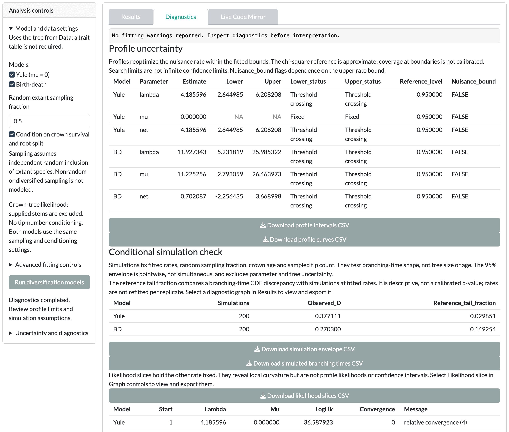
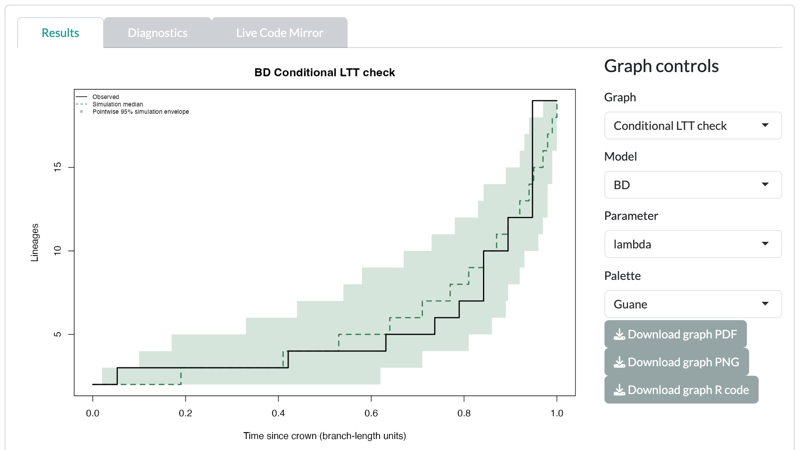

The worked example shows a net diversification interval that spans zero.

::: {.guane-meta}
- **You'll learn** How sampling fractions, bounds and starts change a rate fit, and how to read profile intervals and the conditional LTT check.
- **Time** About 30 minutes
- **Prerequisites** [Diversification tutorial](../diversification.qmd); example tree loaded in the Diversification Data card
:::

::: {.callout-warning title="Scientific caution"}
The bundled example is synthetic. Its branch lengths are in arbitrary units, not ages. Rates are per branch-length unit. Results are a demonstration, not biological evidence.
:::

## Before you start

Load the example in the [Diversification]{.ui} [Data]{.ui} card. These cards use the tree only, so you do not need to match taxa. Each rate card groups its controls in three collapsible sections: [Model and data settings]{.ui} (open), [Advanced fitting controls]{.ui} and [Uncertainty and diagnostics]{.ui}.

## Sampling and bounds

::: {.guane-control}
### Random extant sampling fraction

The share of living species in the clade that your tree includes.

Where
: [[Constant-rate models]{.ui} [Model and data settings]{.ui} [Random extant sampling fraction]{.ui}]{.guane-path}

Default
: 1 (complete sampling); range above 0 up to 1

Change it when
: Your tree is missing species. The fraction assumes every living species had the same chance of inclusion; nonrandom sampling is not modeled. Set it to the number of tips in your tree divided by the number of living species in the clade, from a current taxonomy. If missing species cluster in particular clades, the random-sampling assumption fails; use [Clade sampling fractions (CSV)]{.ui} in [Clade-specific models]{.ui}. Rerun at 1 and at your value to see how much it matters.

Check after
: The model line in [Results]{.ui} shows `sampling.f`. A value out of range stops with "Sampling fraction must be greater than zero and at most one."
:::

::: {.guane-control}
### Rate upper bound (blank = 100 / crown age)

Sets the largest speciation or extinction rate the optimizer may try.

Where
: [[Constant-rate models]{.ui} [Advanced fitting controls]{.ui} [Rate upper bound (blank = 100 / crown age)]{.ui}]{.guane-path}

Default
: Blank: 100 divided by the crown age

Change it when
: A rate sits at the bound. Raise the bound and refit to see whether the estimate moves.

Check after
: The `Boundary` column of the optimizer table in [Diagnostics]{.ui}, and `Nuisance_bound` in the profile table.
:::

::: {.guane-control}
### Initial lambda (blank = derived)

Sets the optimizer's starting speciation rate. [Initial mu (blank = lambda / 2)]{.ui} sets the starting extinction rate.

Where
: [[Constant-rate models]{.ui} [Advanced fitting controls]{.ui}]{.guane-path}

Default
: Blank: lambda is derived from the tree; mu is half of lambda

Change it when
: Starts reach different likelihoods, and you want to test a specific region of the parameter space.

Check after
: "Optimizer starts reached different likelihoods; a global optimum is not guaranteed." Starts outside the bounds stop with "Starting rates must lie inside the selected rate bounds."
:::

## Uncertainty checks

::: {.guane-control}
### Calculate profile likelihoods

Computes a profile likelihood interval for each rate, including net diversification.

Where
: [[Constant-rate models]{.ui} [Uncertainty and diagnostics]{.ui} [Calculate profile likelihoods]{.ui}]{.guane-path}

Default
: On, with [Profile reference level]{.ui} 0.95 and [Profile grid points]{.ui} 61

Change it when
: You need finer intervals (more grid points) or a different reference level.

Check after
: The `Lower_status` and `Upper_status` columns in [Diagnostics]{.ui}. `Threshold crossing` means the interval closed. `Physical boundary` or `Search limit reached` means the interval is open on that side.
:::

::: {.guane-control}
### Simulate conditional LTT curves

Simulates trees under each fitted model and compares their LTT curves with the observed tree.

Where
: [[Constant-rate models]{.ui} [Uncertainty and diagnostics]{.ui} [Simulate conditional LTT curves]{.ui}]{.guane-path}

Default
: On, with [Simulation replicates]{.ui} 200 and [Simulation seed]{.ui} 999

Change it when
: You want a more stable check (more replicates) or a repeatable one (fixed seed).

Check after
: The [Conditional simulation check]{.ui} table in [Diagnostics]{.ui}. `Reference_tail_fraction` is descriptive, not a p-value. Set [Graph]{.ui} to [Conditional LTT check]{.ui} to see the envelope.
:::

## Clades and diversity dependence

::: {.guane-control-grid}
::: {.guane-control}
### Clade sampling fractions (CSV)

Gives each selected clade its own sampling fraction.

Where
: [[Clade-specific models]{.ui} [Model and data settings]{.ui}]{.guane-path}

Default
: Empty: complete sampling (1) for every clade. [Fill sampling table]{.ui} writes a template.

Change it when
: Clades are sampled unevenly. See the [clade sampling format](../../reference/input-formats.qmd#clade-sampling-fractions).

Check after
: Each clade's fit in [Results]{.ui}. Compare models within a clade only.
:::

::: {.guane-control}
### Missing extant species

The number of living species missing from the tree, for diversity-dependent models.

Where
: [[Diversity-dependent models]{.ui} [Model and data settings]{.ui}]{.guane-path}

Default
: 0

Change it when
: Your tree is incomplete. This is a count, not a sampling fraction.

Check after
: The bootstrap needs complete sampling: "Bootstrap requires complete sampling and crown-survival conditioning (cond = 1)."
:::
:::

Two other cards take pasted tables. For custom rate sharing in [Joint clade-dependent models]{.ui}, see the [custom joint constraints format](../../reference/input-formats.qmd#custom-joint-constraints). The time-varying robustness checks run with [Run time-model uncertainty]{.ui}; see [time-varying models](../../reference/limitations.qmd#time-varying-models) for their limits.

## Worked recipe

::: {.guane-recipe}
### Worked example: incomplete sampling, profiles and a simulation check

Start in the [Constant-rate models]{.ui} card, with the example tree loaded in the Data card.

::: {.guane-steps}
1. Keep both [Yule (mu = 0)]{.ui} and [Birth-death]{.ui} under [Models]{.ui}.
2. Set [Random extant sampling fraction]{.ui} to `0.5`. This invented value assumes the tree holds half the living species.
3. Click [Run diversification models]{.ui}. The model line shows `sampling.f = 0.5`.
4. Open [Uncertainty and diagnostics]{.ui}. Set [Simulation replicates]{.ui} to 200 and [Simulation seed]{.ui} to 42.
5. Click [Run uncertainty and diagnostics]{.ui}. The status reads "Diagnostics completed. Review profile limits and simulation assumptions."
6. In [Diagnostics]{.ui}, read the profile table and the [Conditional simulation check]{.ui}.
:::

Expect birth-death to have the lowest AIC, with extinction almost as high as speciation. Every estimated rate's profile limits show `Threshold crossing`. The net diversification interval spans zero, so the data cannot tell growth from decline. The high extinction reflects an evenly spaced synthetic tree and an invented sampling fraction.
:::

{.guane-shot loading="lazy" fig-alt="Constant-rate diagnostics with profile intervals marked Threshold crossing and the conditional simulation check"}

{.guane-shot loading="lazy" fig-alt="Observed lineages through time inside the pointwise 95% simulation envelope for the birth-death fit"}

To see how much the sampling fraction matters, set it back to 1. This clears the whole fit: the status reads "Inputs changed. Run diversification models to update results." Click [Run diversification models]{.ui}, then [Run uncertainty and diagnostics]{.ui}, and compare the two runs. Changing only a setting in [Uncertainty and diagnostics]{.ui} keeps the fit and clears just the diagnostics ("Diagnostic settings changed. Run uncertainty and diagnostics again.").

## Before you interpret

::: {.callout-warning title="Scientific caution"}
- A sampling fraction is an assumption you supply. Report it, and check how much results change with it.
- An interval that spans zero does not show positive or negative net diversification.
- Extinction estimated from a small tree of living species is very sensitive to assumptions.

Read [LTT and whole tree diversification](../../reference/limitations.qmd#div-whole-tree), [Clade dependent diversification](../../reference/limitations.qmd#div-clades) and [Diversity dependent diversification](../../reference/limitations.qmd#div-diversity) before you report.
:::
