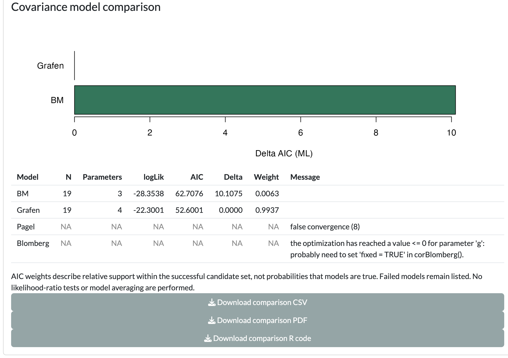
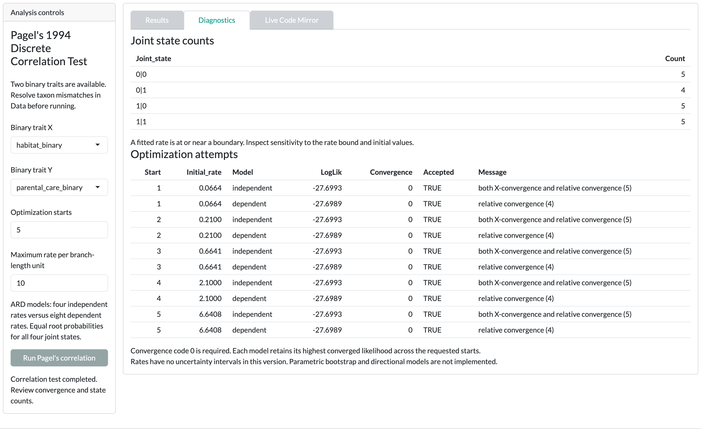

The worked example shows what to do when λ cannot be estimated.

::: {.guane-meta}
- **You'll learn** When to fix a covariance parameter, why ML and REML fits cannot be mixed, and how to read failed fits.
- **Time** About 25 minutes
- **Prerequisites** [Phylo traits tutorial](../phylo-traits.qmd); example loaded and matched in the Phylo traits Data card
:::

::: {.callout-warning title="Scientific caution"}
The bundled example is synthetic. Its values are invented and its branch lengths are arbitrary. Results are a demonstration, not biological evidence.
:::

## Before you start

Load the example in the [Phylo traits]{.ui} [Data]{.ui} card and click [Use matched taxa]{.ui}. [Resolve the mismatch](../../get-started/example-data.qmd#match) shows each step. PGLS needs an ultrametric tree; the example tree is ultrametric. Pagel's correlation and binary PGLM need two-state columns such as `habitat_binary`.

## PGLS covariance

::: {.guane-control}
### Initial or fixed parameter (rho / lambda / g)

Sets the starting value of the correlation parameter, or its fixed value when [Keep correlation parameter fixed]{.ui} is ticked. It is ρ for Grafen, λ for Pagel and g for Blomberg; BM has none.

Where
: [[PGLS]{.ui} [Analysis controls]{.ui} [Initial or fixed parameter (rho / lambda / g)]{.ui}]{.guane-path}

Default
: 0.5, estimated (the box [Keep correlation parameter fixed]{.ui} is off)

Change it when
: The parameter will not estimate, as in the worked example below. Or you want to test one specific value, such as λ = 1. λ must lie between 0 and 1; ρ and g must be positive.

Check after
: The model line in [Results]{.ui} names the fixed value, for example `lambda 1`. A fixed λ of 1 is the same covariance as BM, so it tells you nothing new about λ.
:::

::: {.guane-control}
### Estimation method {#pgls-estimation-method}

Chooses REML or ML for the PGLS fit.

Where
: [[PGLS]{.ui} [Analysis controls]{.ui} [Estimation method]{.ui}]{.guane-path}

Default
: [REML]{.ui}

Change it when
: You want to compare likelihoods or AIC across fits with different fixed effects. Use ML for that. [Compare covariance models (ML)]{.ui} always refits by ML.

Check after
: Only compare log-likelihoods and AIC between fits that both used ML.
:::

## Pagel's correlation search

::: {.guane-control-grid}
::: {.guane-control}
### Optimization starts

Sets how many starting points the optimizer tries for each model.

Where
: [[Pagel's correlation]{.ui} [Analysis controls]{.ui}]{.guane-path}

Default
: 3 (range 1–5)

Change it when
: Attempts disagree, or you want more assurance of the best fit.

Check after
: The [Optimization attempts]{.ui} table in [Diagnostics]{.ui}. "Convergence code 0 is required."
:::

::: {.guane-control}
### Maximum rate per branch-length unit

Sets the upper bound on every transition rate.

Where
: [[Pagel's correlation]{.ui} [Analysis controls]{.ui}]{.guane-path}

Default
: 100

Change it when
: A fitted rate sits at the bound, or your branch-length units make 100 unrealistic.

Check after
: "A fitted rate is at or near a boundary. Inspect sensitivity to the rate bound and initial values."
:::
:::

## PGLM estimation and coding

::: {.guane-control}
### Estimation method {#pglm-estimation-method}

Chooses the `phylolm::phyloglm` estimator for a binary response.

Where
: [[PGLM]{.ui} [Response family]{.ui} [Binary (Bernoulli / logit)]{.ui} [Estimation method]{.ui}]{.guane-path}

Default
: `logistic_MPLE` (the alternative is `logistic_IG10`)

Change it when
: The fit warns that alpha is near its boundary, and you want to check whether the coefficients depend on the estimator.

Check after
: "Alpha is near its optimization boundary; inspect sensitivity before inference."
:::

::: {.guane-control}
### Categorical predictors

Marks predictors as categories. Guane then shows a Reference category picker for each one.

Where
: [[PGLM]{.ui} [Analysis controls]{.ui} [Categorical predictors]{.ui}]{.guane-path}

Default
: Empty; every predictor is treated as continuous

Change it when
: A predictor is a category, including a category coded with numbers. Pick the reference category you want the other categories compared against.

Check after
: The [Diagnostic screens]{.ui} table (LargeResidual, Sparse, OneOutcome), and "Some predictor categories contain fewer than three taxa; estimates may be unstable."
:::

## Worked recipe

::: {.guane-recipe}
### Worked example: when λ cannot be estimated

Start in the [PGLS]{.ui} card, with the example matched in the Data card.

::: {.guane-steps}
1. Set [Response]{.ui} to `body_length` and [Predictors]{.ui} to `body_mass`.
2. Set [Correlation structure]{.ui} to [Pagel]{.ui} and [Estimation method]{.ui} to [ML]{.ui}.
3. Click [Run PGLS]{.ui}. Expect no result: the status reports `false convergence (8)`. The optimizer could not estimate λ.
4. Set [Initial or fixed parameter (rho / lambda / g)]{.ui} to `1` and tick [Keep correlation parameter fixed]{.ui}.
5. Click [Run PGLS]{.ui} again. The status reads "PGLS completed. Review residual diagnostics and fit warnings." The model line ends with `lambda 1`.
6. Click [Compare covariance models (ML)]{.ui}. With λ and g fixed at 1, BM, Pagel and Blomberg give the same log-likelihood. They are the same covariance.
7. Untick [Keep correlation parameter fixed]{.ui}, set [Initial or fixed parameter (rho / lambda / g)]{.ui} back to 0.5, and click [Compare covariance models (ML)]{.ui} again. The status reads "Comparison finished. Review failed models and warnings."
:::

In the second comparison, only BM and Grafen fit, and Grafen takes almost all the weight. The Pagel row fails with `false convergence (8)`, and the Blomberg row fails with an optimizer message about `g`. The weights compare only the two structures that fit. They do not show that λ or g was tested and rejected. If you leave the value at 1, the Pagel row fails differently ("Estimated lambda is outside the supported interval [0, 1]. Try a fixed value or another structure.") and the Grafen row carries the message "Non-positive definite approximate variance-covariance".
:::

{.guane-shot loading="lazy" fig-alt="PGLS covariance comparison where Grafen succeeds and the Pagel and Blomberg rows failed with optimizer messages"}

A shorter check on the Pagel's correlation card: set [Optimization starts]{.ui} to 5 and [Maximum rate per branch-length unit]{.ui} to 10, then run. Expect every attempt to converge, the two models to reach nearly the same likelihood, and the boundary warning to appear.

{.guane-shot loading="lazy" fig-alt="Pagel correlation diagnostics listing joint state counts, a boundary warning and ten converged optimization attempts"}

## Before you interpret

::: {.callout-warning title="Scientific caution"}
- A failed fit is a result. Do not drop the failed rows and read the remaining weights as a test of λ or g.
- Fixing a parameter answers a narrower question than estimating it. Report which parameters you fixed.
- Compare likelihoods only between ML fits on the same data.

Read [Phylogenetic signal and PGLS](../../reference/limitations.qmd#signal-pgls) and [Pagel's correlation and PGLM](../../reference/limitations.qmd#pagel-pglm) before you report.
:::
