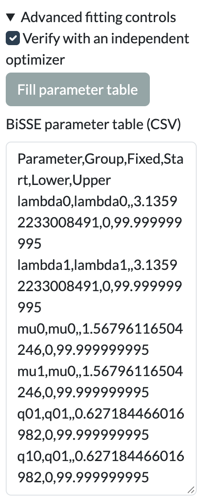
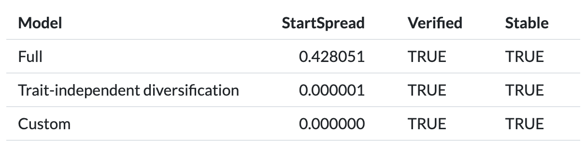
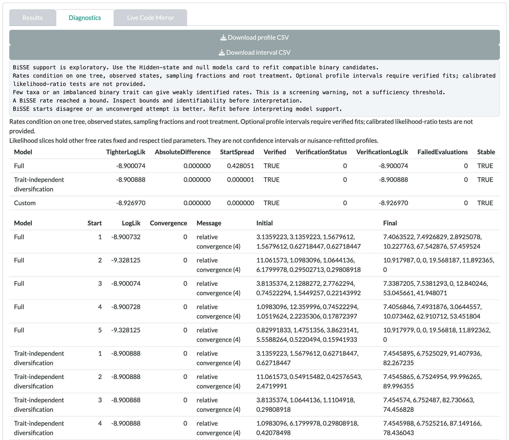

The worked example shows why Guane withholds model weights.

::: {.guane-meta}
- **You'll learn** How to build a constrained BiSSE model, what the optimizer checks mean, and when Guane withholds weights.
- **Time** About 35 minutes
- **Prerequisites** [SSE models tutorial](../sse.qmd); example loaded and matched in the SSE models Data card
:::

::: {.callout-warning title="Scientific caution"}
The bundled example is synthetic. Its values are invented and its branch lengths are arbitrary. Results are a demonstration, not biological evidence.
:::

## Before you start

Load the example in the [SSE models]{.ui} [Data]{.ui} card and click [Use matched taxa]{.ui}. [Resolve the mismatch](../../get-started/example-data.qmd#match) shows each step. Each SSE card groups its controls in collapsible sections, such as [Model and data settings]{.ui} (open) and [Advanced fitting controls]{.ui}.

## Sampling and root

::: {.guane-control-grid}
::: {.guane-control}
### Sampling fraction for state 0

The share of living species in state 0 that your tree includes. [Sampling fraction for state 1]{.ui} does the same for state 1.

Where
: [[BiSSE]{.ui} [Model and data settings]{.ui}]{.guane-path}

Default
: 1 for each state

Change it when
: Species in one state are better sampled than in the other. Unequal sampling can mimic state-dependent diversification.

Check after
: The model line in [Results]{.ui} shows `sampling.f`.
:::

::: {.guane-control}
### Root treatment

Sets how the root state is weighted in the likelihood.

Where
: [[BiSSE]{.ui} [Model and data settings]{.ui} [Root treatment]{.ui}]{.guane-path}

Default
: [Observed (ROOT.OBS)]{.ui}

Change it when
: You have a justified root prior. [Given (ROOT.GIVEN)]{.ui} opens [Root probability for state 0]{.ui}.

Check after
: The model line in [Results]{.ui} shows `root`. Every candidate in the run uses the same root treatment.
:::
:::

## Constraints and search

::: {.guane-control}
### BiSSE parameter table (CSV)

Ties, fixes and bounds each rate for a [Custom]{.ui} model.

Where
: [[BiSSE]{.ui} [Advanced fitting controls]{.ui} [BiSSE parameter table (CSV)]{.ui}]{.guane-path}

Default
: Empty. Click [Fill parameter table]{.ui} for a template, and tick [Custom]{.ui} under [Models]{.ui}.

Change it when
: You want a hypothesis the presets do not cover, such as equal extinction with state-specific speciation. Rates with the same `Group` are tied. See the [parameter table format](../../reference/input-formats.qmd#sse-parameter-tables).

Check after
: The [Effective parameter constraints]{.ui} table in [Diagnostics]{.ui}. Incompatible ties stop with "Tied BiSSE rates have incompatible fixed values or bounds."
:::

::: {.guane-control-grid}
::: {.guane-control}
### Optimizer starts

Sets how many deterministic starting points each model gets.

Where
: [[BiSSE]{.ui} [Advanced fitting controls]{.ui}]{.guane-path}

Default
: 3 (range 1–8)

Change it when
: Starts disagree. Guane needs at least two starts to show weights.

Check after
: The `StartSpread` column, and "BiSSE starts disagree or an unconverged attempt is better. Refit before interpreting model support."
:::

::: {.guane-control}
### Verify with an independent optimizer

Refits each model with a second optimizer from its best point.

Where
: [[BiSSE]{.ui} [Advanced fitting controls]{.ui}]{.guane-path}

Default
: On

Change it when
: Leave it on. Without verification, Guane does not show weights.

Check after
: The `Verified` column, and "Independent optimizer verification failed or disagreed. Weights and intervals are withheld."
:::
:::

## QuaSSE numerics

::: {.guane-control-grid}
::: {.guane-control}
### Measurement-error column

Uses a column of per-species standard errors for the continuous trait.

Where
: [[QuaSSE]{.ui} [Model and data settings]{.ui} [Measurement-error column]{.ui}]{.guane-path}

Default
: [Common standard error]{.ui}, which uses [Common measurement standard error]{.ui} (1)

Change it when
: You have measured standard errors, in trait units. Zero and missing errors are not supported.

Check after
: "The tip grid is coarser than a measurement standard error. Increase resolution; model weights are withheld."
:::

::: {.guane-control}
### Trait grid bins

Sets the resolution of the trait grid that QuaSSE integrates over.

Where
: [[QuaSSE]{.ui} [Numerical integration controls]{.ui} [Trait grid bins]{.ui}]{.guane-path}

Default
: 1024

Change it when
: The tip grid is coarser than the measurement error, or the likelihood is unstable.

Check after
: "Every fit is checked with twice the grid bins and half the time step. Unstable likelihoods suppress model weights."
:::
:::

## Worked recipe

::: {.guane-recipe}
### Worked example: a custom BiSSE with tied rates

Start in the [BiSSE]{.ui} card, with the example matched in the Data card.

::: {.guane-steps}
1. Set [Binary trait]{.ui} to `habitat_binary`. [Observed value coded as state 0]{.ui} defaults to `aquatic`.
2. Open [Advanced fitting controls]{.ui} and click [Fill parameter table]{.ui}.
3. In [BiSSE parameter table (CSV)]{.ui}, change the `Group` of `mu1` to `mu0` and the `Group` of `q10` to `q01`. This ties extinction across states and makes transitions symmetric.
4. Under [Models]{.ui}, tick [Full]{.ui}, [Trait-independent diversification]{.ui} and [Custom]{.ui}.
5. Set [Sampling fraction for state 0]{.ui} and [Sampling fraction for state 1]{.ui} to `0.8` (invented values), and [Optimizer starts]{.ui} to 5.
6. Click [Run BiSSE]{.ui}. The status reads "BiSSE completed. Review convergence, bounds and model assumptions."
7. Open [Diagnostics]{.ui} and check [Effective parameter constraints]{.ui}: the Custom model shows the tied groups.
:::

Expect the three models to reach log-likelihoods within a few hundredths of each other, with no weights: "BiSSE ranking weights are unavailable. Inspect individual fits and diagnostics." [Diagnostics]{.ui} warns "A BiSSE rate reached a bound. Inspect bounds and identifiability before interpretation." and that starts disagree for the Full model. A 19-tip tree cannot separate these models. Its transition rates run to their upper bound, the same pattern as in [Advanced ancestral states](asr.qmd#worked-recipe). If you try [Run profile uncertainty]{.ui} on the Full model, Guane refuses: "Resolve fit diagnostics before calculating profile intervals."
:::

{.guane-shot loading="lazy" width="228" fig-alt="BiSSE advanced fitting controls with a parameter table tying mu1 to mu0 and q10 to q01"}

In the verification table, the Full model's `StartSpread` is well above zero, while `Verified` and `Stable` are TRUE for all three models. Start disagreement alone is enough to withhold the weights.

{.guane-shot loading="lazy" width="606" fig-alt="BiSSE verification table with columns Model, StartSpread, Verified and Stable: Full has a start spread of about 0.43, Trait-independent diversification and Custom are near zero, and all three are Verified and Stable TRUE"}

{.guane-shot loading="lazy" fig-alt="BiSSE diagnostics with bound and start-disagreement warnings and the verification table for three models"}

## When weights are withheld

Guane shows model weights only when every candidate in the run passes all of these checks:

- At least two models are selected under [Models]{.ui}.
- It converged, and all of its starts converged.
- Its likelihood is stable under tighter integration tolerance.
- The independent optimizer verified it.
- No rate sits at a bound.
- Its starts agree, and there were at least two starts.
- No other candidate found a better feasible point for it.
- No two candidates have identical constraints.

If any check fails, the weights column stays empty. The failing check is named in [Diagnostics]{.ui}.

## Before you interpret

::: {.callout-warning title="Scientific caution"}
- A BiSSE preference for trait-dependent rates can come from rate differences unrelated to the trait. Refit in [Hidden-state and null models]{.ui} and compare against CID-2 and CID-4.
- Missing weights mean the models could not be ranked. Do not compute them yourself.
- Sampling fractions and measurement errors are assumptions you supply. Report them.

Read [State-dependent speciation and extinction](../../reference/limitations.qmd#sse) before you report.
:::
