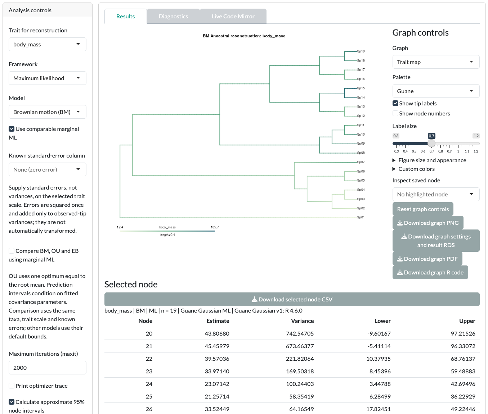
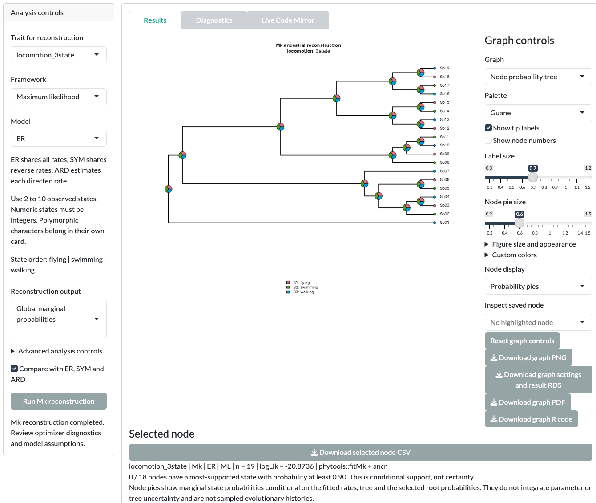

In this tutorial you estimate ancestral states for three kinds of trait: `body_mass` (continuous), `locomotion_3state` (discrete) and `resource_use_polymorphic` (polymorphic). Each estimate is conditional on the tree, the tip data and the model you choose.

::: {.guane-meta}
- **You'll learn** How to run continuous, Mk and polymorphic reconstructions, and how node estimates differ from sampled histories.
- **Time** About 25 minutes
- **Prerequisites** [Guane running](../get-started/install.qmd); example loaded and matched in the Ancestral state reconstruction Data card
:::

::: {.callout-warning title="Scientific caution"}
The bundled example is synthetic. Its values are invented and its branch lengths are arbitrary. Results are a demonstration, not biological evidence.
:::

## Before you start

Open [Ancestral state reconstruction]{.ui}, then its [Data]{.ui} card. Load the example and click [Use matched taxa]{.ui}. [Resolve the mismatch](../get-started/example-data.qmd#match) shows each step.

Each card's [Framework]{.ui} menu lists [Parsimony — planned]{.ui}. Parsimony is not available yet.

## Continuous traits

::: {.guane-steps}
1. Open the [Continuous traits]{.ui} card.
2. Set [Trait for reconstruction]{.ui} to `body_mass`.
3. Set [Framework]{.ui} to [Maximum likelihood]{.ui} and [Model]{.ui} to [Brownian motion (BM)]{.ui}.
4. Click [Run continuous reconstruction]{.ui}.
5. In [Results]{.ui}, switch [Graph]{.ui} between [Trait map]{.ui}, [Phenogram]{.ui}, [Node intervals]{.ui} and [Selected node]{.ui}.
6. Open [Diagnostics]{.ui} and read any model warnings.
:::

{.guane-shot loading="lazy" fig-alt="Tree map of reconstructed body_mass values along branches, with a table of node estimates and intervals"}

To compare models, tick [Compare BM, OU and EB using marginal ML]{.ui} and run again. The comparison uses the same data and likelihood basis. OU and EB results need you to read their parameters and warnings; Guane may withhold intervals when they are unreliable.

For a Bayesian fit, set [Framework]{.ui} to [Bayesian BM]{.ui}. The card then shows MCMC controls, such as [MCMC generations per chain]{.ui} and [Chains]{.ui}, and posterior diagnostics.

## Discrete traits

::: {.guane-steps}
1. Open the [Discrete traits]{.ui} card.
2. Set [Trait for reconstruction]{.ui} to `locomotion_3state`.
3. Set [Framework]{.ui} to [Maximum likelihood]{.ui} and [Model]{.ui} to ER.
4. Click [Run Mk reconstruction]{.ui}.
5. In [Results]{.ui}, view the [Node probability tree]{.ui}. Switch [Graph]{.ui} to [Transition-rate diagram]{.ui} to see the fitted rates.
6. Open [Diagnostics]{.ui}. Read the warnings and the model comparison before you interpret the pies.
:::

{.guane-shot loading="lazy" fig-alt="Tree with pie charts of marginal state probabilities for locomotion at each node"}

With the synthetic example, every node shows one third for each state. [Results]{.ui} reports "0 / 18 nodes have a most-supported state with probability at least 0.90". [Diagnostics]{.ui} warns that "A rate is near an optimization bound". The fitted ER rate has run to its upper limit. The model therefore treats the states as reshuffling along every branch, so the tips carry no information about their ancestors, and each node falls back to equal probabilities. This is an honest result, not a finding: do not read a pie's largest slice, or the model weights, as evidence.

The [Model]{.ui} menu also offers SYM, ARD and Custom. [Advanced analysis controls]{.ui} hold root weights, optimizer settings and fixed rates. For custom matrices, see [Custom input formats](../reference/input-formats.qmd#ancestral-state-reconstruction).

Two other frameworks answer different questions:

- [Stochastic mapping (fixed fitted rates)]{.ui} samples histories conditional on the fitted rates and the tree.
- [Bayesian Mk (sample rates)]{.ui} samples the rates themselves, with chain settings and diagnostics.

## Polymorphic traits

A polymorphic value such as `fruit+seed` means both states coexist in the species. It is not uncertainty.

::: {.guane-steps}
1. Open the [Polymorphic traits]{.ui} card.
2. Set [Trait for reconstruction]{.ui} to `resource_use_polymorphic`.
3. Leave [Ordered polymorphism]{.ui} off.
4. Set [Framework]{.ui} to [Maximum likelihood]{.ui} and [Model]{.ui} to ER.
5. Read the [Transition preview]{.ui}.
6. Click [Run polymorphic reconstruction]{.ui}.
:::

Use unordered models with this example. It contains all three pairwise combinations, so no linear order can make every pair contiguous. An ordered analysis would reject it.

## Node estimates, histories and interpolation

These outputs look alike on a tree, but they answer different questions:

| Output | What it is |
|---|---|
| Marginal node probabilities | Support for each state at one node, under the fitted model. |
| Joint ML assignments | The single most likely set of states across all nodes together. |
| Sampled histories | Possible histories drawn from the model, conditional on rates and tree. |
| Branch colors and phenogram lines | Interpolation between fitted node values. They are not observed trajectories. |

Use the method label shown with each result. Each card exports its graph as editable R code, PDF and PNG, and its data as CSV or RDS.

## Before you interpret

::: {.callout-warning title="Scientific caution"}
- Every reconstruction is conditional on one tree, the tip data and the chosen model.
- Near-equal node probabilities mean the data do not resolve the state; they are not a finding.
- Sampled histories, marginal probabilities and joint assignments are different quantities.

Read [Continuous ancestral reconstruction](../reference/limitations.qmd#asr-continuous), [Discrete and polymorphic ancestral reconstruction](../reference/limitations.qmd#asr-discrete) and [Bayesian ancestral reconstruction](../reference/limitations.qmd#asr-bayesian) before you report.
:::

## Next step

Change the controls beyond the defaults in [Advanced ancestral states](advanced/asr.qmd).
