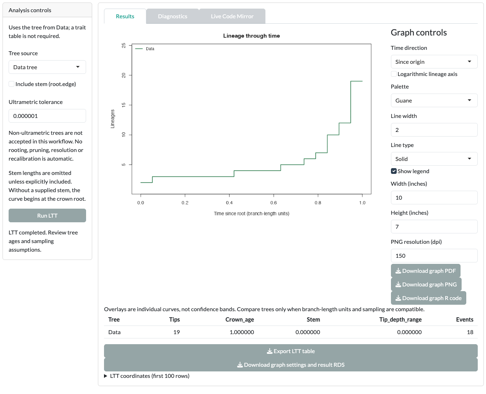
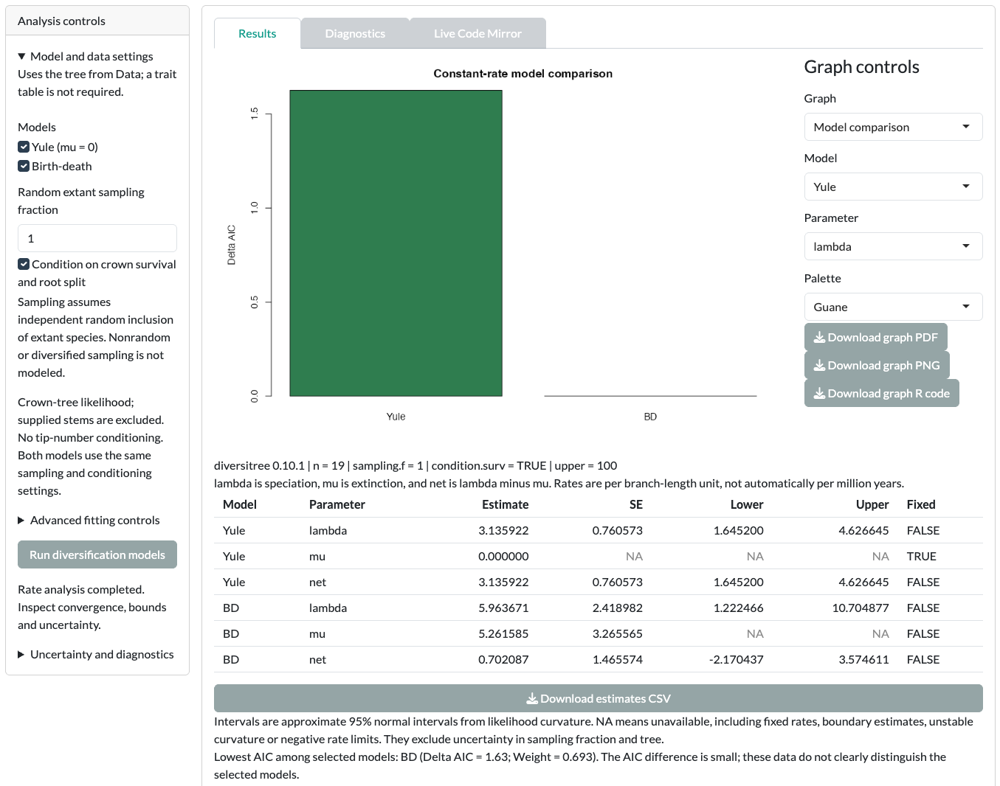

In this tutorial you plot lineages through time (LTT) for the example tree. You then fit constant-rate models and see where the other rate cards fit. Diversification cards use the tree only.

::: {.guane-meta}
- **You'll learn** How to draw an LTT curve, fit Yule and birth-death models, and read a model comparison.
- **Time** About 20 minutes
- **Prerequisites** [Guane running](../get-started/install.qmd); example tree loaded in the Diversification Data card
:::

::: {.callout-warning title="Scientific caution"}
The bundled example is synthetic. Its branch lengths are in arbitrary units, not ages. Rates are per branch-length unit, not per year or per million years. Results are a demonstration, not biological evidence.
:::

## Before you start

Open [Diversification]{.ui}, then its [Data]{.ui} card, and click [Load example data]{.ui}. These cards use the tree only, so you do not need to match taxa. See [Example data and the Data card](../get-started/example-data.qmd) for what the example contains.

## Lineage through time

An LTT curve counts the surviving lineages in a tree through its history. It is a description of the tree. It does not estimate speciation or extinction.

::: {.guane-steps}
1. Open the [Lineage through time]{.ui} card.
2. Leave [Tree source]{.ui} set to [Data tree]{.ui}.
3. Click [Run LTT]{.ui}.
4. In [Graph controls]{.ui}, change [Time direction]{.ui} from [Since origin]{.ui} to [Before present]{.ui}, or tick [Logarithmic lineage axis]{.ui}.
:::

{.guane-shot loading="lazy" fig-alt="Lineage-through-time curve for the example tree in branch-length units"}

To overlay several trees, set [Tree source]{.ui} to [Uploaded tree set]{.ui} and upload up to 25 Newick files. Only overlay trees with comparable sampling and branch-length units.

## Constant-rate models

::: {.guane-steps}
1. Open the [Constant-rate models]{.ui} card.
2. Under [Models]{.ui}, keep both [Yule (mu = 0)]{.ui} and [Birth-death]{.ui} selected.
3. Click [Run diversification models]{.ui}.
4. In [Results]{.ui}, [Graph]{.ui} starts at [Rate estimates]{.ui}. Set it to [Model comparison]{.ui} to see ΔAIC for each model.
5. Click [Run uncertainty and diagnostics]{.ui} for profile likelihoods and conditional LTT checks.
:::

{.guane-shot loading="lazy" fig-alt="Model comparison of Yule and birth-death fits on the example tree, shown as Delta AIC bars with estimates"}

With the synthetic example, expect the app to say the data do not clearly distinguish the selected models. That is the honest reading: a 20-tip tree carries little information about extinction.

## Other rate cards

Each remaining card answers a different rate question. Run each one the same way: set its options, click its run button, then read [Results]{.ui} and [Diagnostics]{.ui}.

::: {.guane-table-scroll role="region" tabindex="0" aria-label="Diversification rate cards"}
| Card | First run with the example | How to read it |
|---|---|---|
| [Time-varying models]{.ui} | Keep the default candidates (Yule, BD, ExpYule, ExpBD). Click [Run time-varying comparison]{.ui}. | View rates through time. [Run time-model uncertainty]{.ui} adds profile, bootstrap and robustness checks. An exponential curve is a model assumption. |
| [Clade-specific models]{.ui} | Choose non-overlapping [Crown nodes]{.ui} with at least four tips each. Click [Preview selected clades]{.ui}, then [Run clade models]{.ui}. | Each clade is fitted separately. Compare models **within** a clade, not AIC across clades. |
| [Joint clade-dependent models]{.ui} | Choose [Joint shift nodes]{.ui}. Click [Preview joint regions]{.ui}, then [Run joint models]{.ui}. | One whole-tree likelihood with shared or shifted rates. Shifts sit at the base of the chosen branch. |
| [Diversity-dependent models]{.ui} | Keep the default model. Click [Run diversity-dependent models]{.ui}, then [Run numerical diagnostics]{.ui}. | Curves relate rates to modeled diversity. [Run uncertainty and robustness]{.ui} adds optional checks with more assumptions. |
:::

For every rate card, check failed starts, parameter bounds and numerical stability before you read estimates or model weights. Sampling fractions are taken as given. For clade and region sampling tables, see [Custom input formats](../reference/input-formats.qmd#diversification).

## Before you interpret

::: {.callout-warning title="Scientific caution"}
- Rates are per branch-length unit. The example tree is not dated.
- An LTT curve describes the tree; it does not estimate speciation or extinction.
- Extinction estimates from a small tree of living species are very sensitive to assumptions.

Read [LTT and whole tree diversification](../reference/limitations.qmd#div-whole-tree), [Clade dependent diversification](../reference/limitations.qmd#div-clades) and [Diversity dependent diversification](../reference/limitations.qmd#div-diversity) before you report.
:::

## Next step

Change the controls beyond the defaults in [Advanced diversification](advanced/diversification.qmd).
