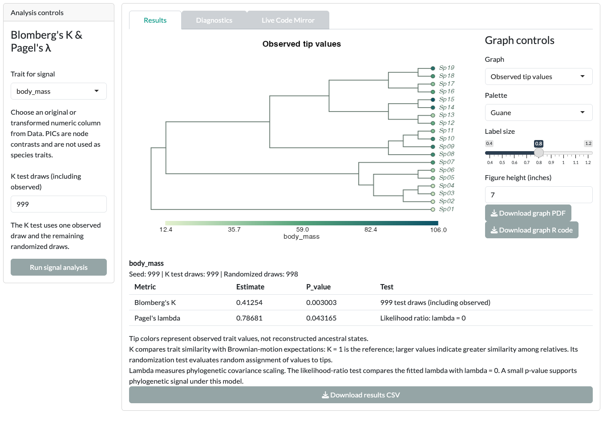
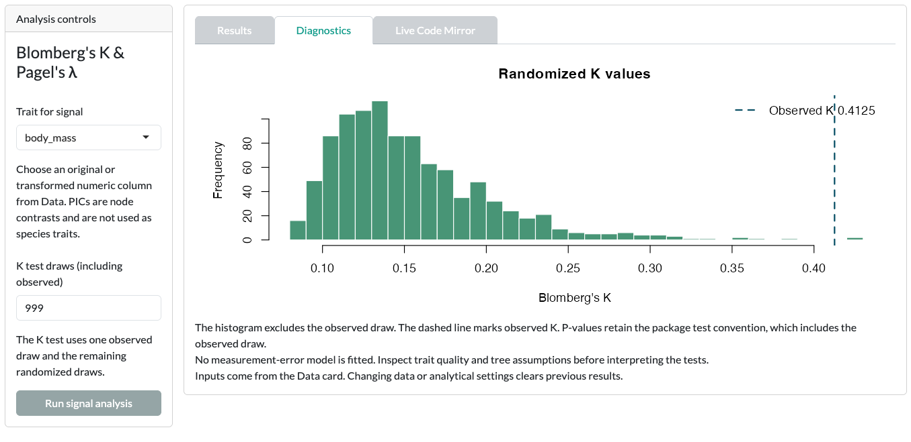
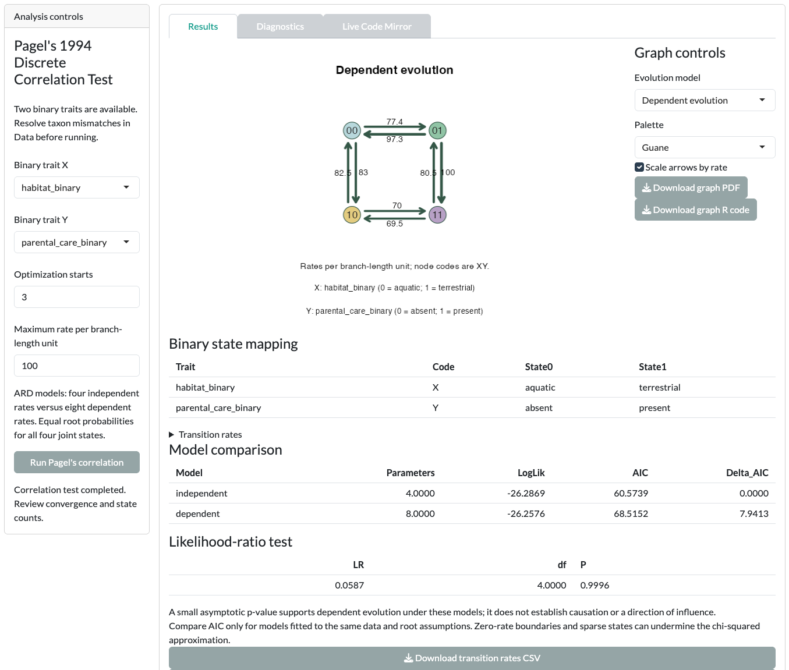

In this tutorial you measure phylogenetic signal in `body_mass`. You then try the other three cards in the [Phylo traits]{.ui} module: PGLS, Pagel's correlation and PGLM.

::: {.guane-meta}
- **You'll learn** How to run and read Blomberg's K and Pagel's λ, and where PGLS, Pagel's correlation and PGLM fit.
- **Time** About 25 minutes
- **Prerequisites** [Guane running](../get-started/install.qmd); example loaded and matched in the Phylo traits Data card
:::

::: {.callout-warning title="Scientific caution"}
The bundled example is synthetic. Its values are invented and its branch lengths are arbitrary. Results are a demonstration, not biological evidence.
:::

## Before you start

Open [Phylo traits]{.ui}, then its [Data]{.ui} card. Load the example and click [Use matched taxa]{.ui}. [Resolve the mismatch](../get-started/example-data.qmd#match) shows each step.

## Phylogenetic signal

This card asks whether species' values resemble those of their relatives more than expected under the reference tests. It reports Blomberg's K, with a randomization test, and Pagel's λ.

::: {.guane-steps}
1. Open the [Phylogenetic signal]{.ui} card.
2. Set [Trait for signal]{.ui} to `body_mass`.
3. Leave [K test draws (including observed)]{.ui} at 999 for a first pass.
4. Click [Run signal analysis]{.ui}.
5. In [Results]{.ui}, read Blomberg's K and Pagel's λ. The tree shows observed tip values.
6. Open [Diagnostics]{.ui} to see the randomized K distribution.
:::

{.guane-shot loading="lazy" fig-alt="Tree with tips colored by observed body_mass, above a table of Blomberg's K and Pagel's lambda results"}

{.guane-shot loading="lazy" fig-alt="Histogram of randomized K values with a dashed line at the observed K"}

The randomization uses the [Seed]{.ui} from the Data card, so you can repeat the same run.

### Rerun on the log scale

::: {.guane-steps}
1. In the [Data]{.ui} card, create `body_mass_log` as shown in [Check and transform a trait](../get-started/example-data.qmd#check-and-transform-a-trait).
2. Return to [Phylogenetic signal]{.ui} and set [Trait for signal]{.ui} to `body_mass_log`.
3. Click [Run signal analysis]{.ui} again.
:::

The log scale is a different measured scale, so K and λ can change. The original `body_mass` column stays unchanged.

### Save the script and graph

Under [Graph controls]{.ui}, choose the [Graph]{.ui} and its appearance. Click [Download graph R code]{.ui} for a standalone R script that reruns the K and λ tests and redraws the graph. [Download graph PDF]{.ui} is under [Graph controls]{.ui}; [Download results CSV]{.ui} is under the results table.

## PGLS

PGLS fits a continuous response against one or more numeric predictors, allowing for phylogenetic covariance. This card needs an ultrametric tree; the example tree is ultrametric.

::: {.guane-steps}
1. Open the [PGLS]{.ui} card.
2. Set [Response]{.ui} to `body_mass` and add `temperature` under [Predictors]{.ui}.
3. Choose a [Correlation structure]{.ui}: BM, Grafen, Pagel or Blomberg.
4. Click [Run PGLS]{.ui}.
5. In [Results]{.ui}, read the coefficients. Switch [Graph]{.ui} between [Observed versus fitted]{.ui}, [Coefficient intervals]{.ui} and [Residual diagnostics]{.ui}.
6. Optionally, click [Compare covariance models (ML)]{.ui}. It fits the four structures by ML on the same data.
:::

Do not rank REML fits with different fixed effects as if their likelihoods were comparable. An association is not proof of causation.

## Pagel's correlation

This card runs Pagel's 1994 test of correlated evolution between **two binary traits**. It compares an independent model with a dependent one. It is not a regression.

::: {.guane-steps}
1. Open the [Pagel's correlation]{.ui} card.
2. Set [Binary trait X]{.ui} to `habitat_binary` and [Binary trait Y]{.ui} to `parental_care_binary`.
3. Click [Run Pagel's correlation]{.ui}.
4. In [Results]{.ui}, set [Evolution model]{.ui} to [Dependent evolution]{.ui} to see the transition diagram.
5. Check [Diagnostics]{.ui} for convergence and joint state counts.
:::

{.guane-shot loading="lazy" fig-alt="Dependent-evolution transition diagram for habitat_binary and parental_care_binary, with model comparison tables"}

With the synthetic example, expect a likelihood-ratio P value close to 1. The dependent model is not supported. The diagram shows what the dependent model fitted; it is not evidence of correlated evolution. A small dataset with few taxa per joint state is often weakly informative.

## PGLM

PGLM relates a non-Gaussian response to predictors, allowing for phylogenetic structure. The card supports binary, count and grouped-binomial responses.

::: {.guane-steps}
1. Open the [PGLM]{.ui} card.
2. Set [Response family]{.ui} to [Counts (Poisson GEE / log)]{.ui}.
3. Set [Response / successes]{.ui} to `offspring_count`.
4. Add `body_mass` and `temperature` under [Predictors]{.ui}.
5. Click [Run PGLM]{.ui}.
6. After the fit, click [Run taxon influence diagnostics]{.ui} to see how much each species affects the result.
:::

To try the grouped-binomial family, set [Response family]{.ui} to [Grouped binomial (GEE / logit)]{.ui}. Set [Response / successes]{.ui} to `success_count` and [Total trials]{.ui} to `trial_count`. Trials are a count, not a predictor or an offset.

If a predictor is categorical, mark it under [Categorical predictors]{.ui} and choose its reference category. Count and grouped-binomial GEE fits have no likelihood-based AIC comparison.

## Before you interpret

::: {.callout-warning title="Scientific caution"}
- A significant signal test does not identify the process that caused the pattern.
- Trait normality does not establish normal model residuals. PICs are node contrasts, not species traits.
- Pagel's correlation depends on state coding and a fixed tree. GEE fits have no AIC comparison.

Read [Phylogenetic signal and PGLS](../reference/limitations.qmd#signal-pgls) and [Pagel's correlation and PGLM](../reference/limitations.qmd#pagel-pglm) before you report.
:::

## Next step

Change the controls beyond the defaults in [Advanced phylo traits](advanced/phylo-traits.qmd).
