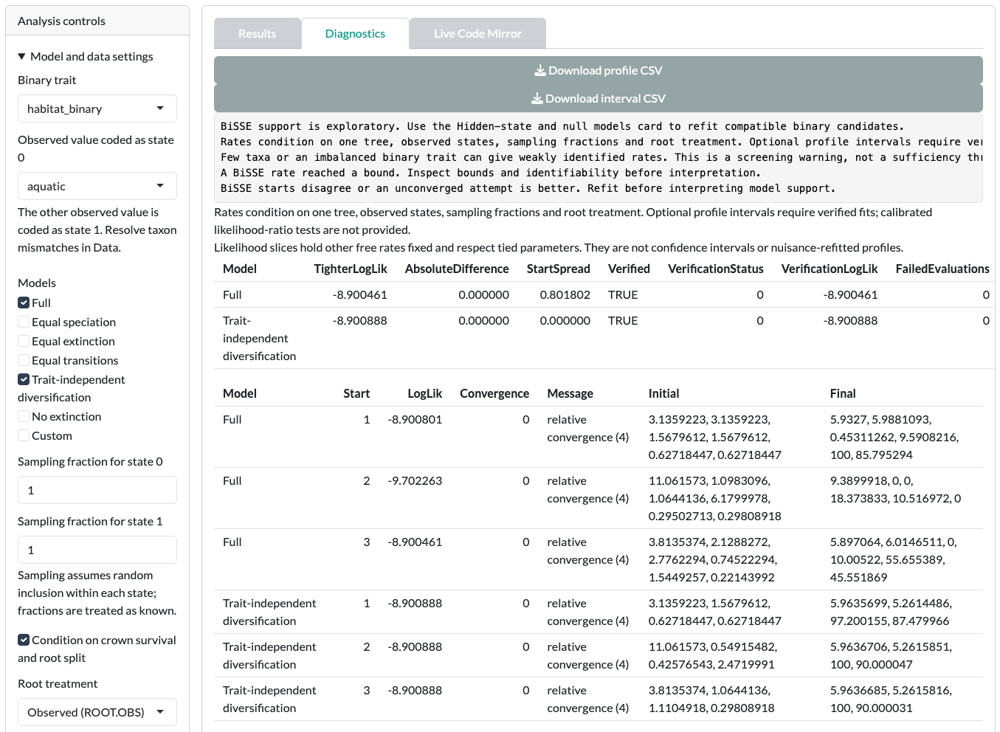

In this tutorial you fit BiSSE, a state-dependent speciation and extinction model, to `habitat_binary`. You read its diagnostics, then try the MuSSE, QuaSSE and hidden-state cards. The small example is for learning the controls and the checks, not for testing a hypothesis.

::: {.guane-meta}
- **You'll learn** How to fit BiSSE, read its diagnostics, and know why Guane may withhold model weights.
- **Time** About 30 minutes
- **Prerequisites** [Guane running](../get-started/install.qmd); example loaded and matched in the SSE models Data card
:::

::: {.callout-warning title="Scientific caution"}
The bundled example is synthetic. Its values are invented and its branch lengths are arbitrary. Results are a demonstration, not biological evidence.
:::

## Before you start

Open [SSE models]{.ui}, then its [Data]{.ui} card. Load the example and click [Use matched taxa]{.ui}. [Resolve the mismatch](../get-started/example-data.qmd#match) shows each step.

## BiSSE

BiSSE fits separate speciation (λ₀, λ₁) and extinction (μ₀, μ₁) rates for two observed states, plus transition rates between them.

::: {.guane-steps}
1. Open the [BiSSE]{.ui} card.
2. Set [Binary trait]{.ui} to `habitat_binary`.
3. Choose the [Observed value coded as state 0]{.ui}. The other value becomes state 1.
4. Under [Models]{.ui}, keep the defaults: [Full]{.ui} and [Trait-independent diversification]{.ui}.
5. Click [Run BiSSE]{.ui}.
6. Open [Diagnostics]{.ui} before you look at [Results]{.ui}.
:::

{.guane-shot loading="lazy" fig-alt="BiSSE diagnostics listing warnings, verification status and optimizer starts for each model"}

### Read the diagnostics

With the synthetic example, expect [Diagnostics]{.ui} to open with warnings, including "A BiSSE rate reached a bound". This is the app doing its job. Check these points before you trust any estimate:

- **Bounds.** A rate at its bound is not a reliable estimate. Look at which parameter hit the bound in [Effective parameter constraints]{.ui}.
- **Optimizer starts.** Compare the log-likelihoods across starts. If starts disagree, refit before you interpret the result.
- **Independent verification.** Check that each model was verified by an independent optimizer.
- **Data size.** Few taxa or an unbalanced trait give weakly identified rates. A 19-tip example is small.

### Profile uncertainty

After a fit, you can profile one rate:

::: {.guane-steps}
1. In [Graph controls]{.ui}, choose the [Model]{.ui} and [Parameter]{.ui} to profile.
2. In [Analysis controls]{.ui}, open [Profile uncertainty]{.ui}. Enter finite [Profile lower search bound]{.ui} and [Profile upper search bound]{.ui} values that enclose the estimate.
3. Click [Run profile uncertainty]{.ui}.
4. Read the interval and profile grid in [Diagnostics]{.ui}. An unresolved endpoint is shown as unavailable.
:::

## MuSSE

MuSSE extends BiSSE to 2 to 8 observed categorical states.

::: {.guane-steps}
1. Open the [MuSSE]{.ui} card.
2. Set [Discrete trait]{.ui} to `locomotion_3state`.
3. Click [Fill state table]{.ui} and check the state-to-code mapping.
4. Click [Run MuSSE]{.ui}.
:::

The number of parameters grows quickly with the number of states. For the state table format, see [Custom input formats](../reference/input-formats.qmd#sse-models).

## QuaSSE

QuaSSE links speciation and extinction to a continuous trait.

::: {.guane-steps}
1. Open the [QuaSSE]{.ui} card.
2. Set [Continuous trait]{.ui} to `body_mass`.
3. For practice, enter `10` in [Common measurement standard error]{.ui}. This is an invented value, not a biological measurement.
4. Click [Run QuaSSE]{.ui}.
5. Click [Run grid and domain refits]{.ui} as an extra numerical check.
:::

Check grid resolution, integration stability and optimizer verification in [Diagnostics]{.ui}. With real data, you must justify any measurement error you supply.

## Hidden-state and null models

This card compares hidden-state models (HiSSE) with character-independent null models (CID-2, CID-4). Hidden classes are latent rate categories, not observed traits.

::: {.guane-steps}
1. Open the [Hidden-state and null models]{.ui} card.
2. Set [Binary trait]{.ui} to `habitat_binary` and choose [State 0]{.ui}.
3. Under [Models]{.ui}, keep [HiSSE]{.ui}, [CID-2]{.ui} and [CID-4]{.ui}.
4. Click [Run hidden-state models]{.ui}.
5. In [Diagnostics]{.ui}, check native termination and independent verification before you use any comparison.
:::

## Why weights may be withheld

Guane may show a finite likelihood but no model weight. It withholds weights unless the fits pass checks for convergence, repeatability, bounds and independent verification. The warnings in [Diagnostics]{.ui} explain which check failed.

Compare AIC only within one card run. Do not compare AIC between the BiSSE, MuSSE, QuaSSE and hidden-state cards.

## Before you interpret

::: {.callout-warning title="Scientific caution"}
- A BiSSE preference for trait-dependent rates can be produced by rate differences unrelated to the trait. Refit in [Hidden-state and null models]{.ui} and compare against CID-2 and CID-4 before you interpret it.
- A trait-dependent rate is an association under the model, not proof that the trait caused diversification.
- Rates at bounds, disagreeing starts or failed verification mean the estimate is not reliable.
- Multistate hidden-state models, calibrated SSE tests and QuaSSE or hidden-state intervals are not available.

Read [State-dependent speciation and extinction](../reference/limitations.qmd#sse) before you report.
:::

## Next step

Change the controls beyond the defaults in [Advanced SSE models](advanced/sse.qmd).
